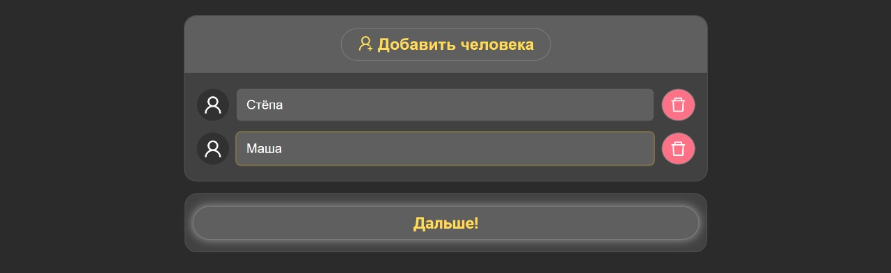
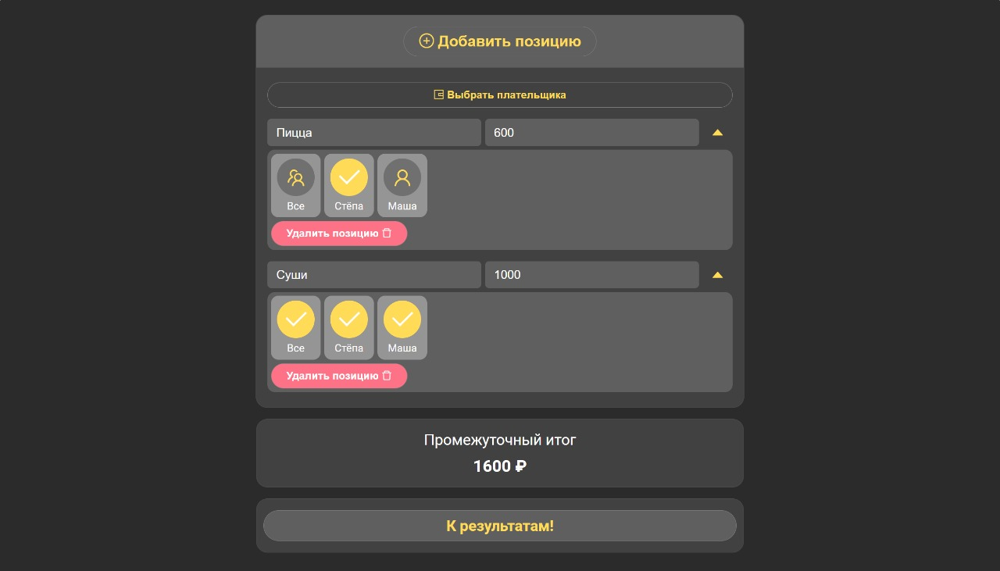
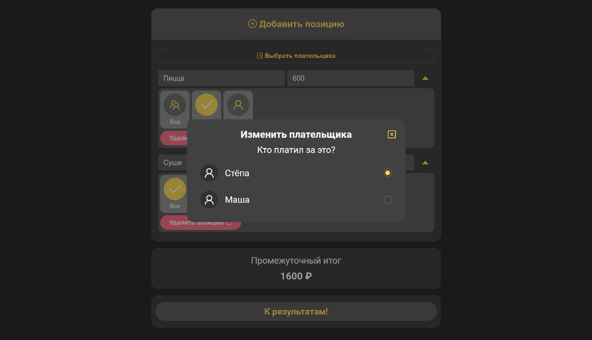

# Делим счёт

## Описание проекта
Приложение для деления счёта на нескольких людей

## Основные функции 
* Добавление людей 
* Добавление позиций с указанием пользователей, которые её ели/пили
* Выбор плательщика
* Проверка результата и рассчет долгов

## Используемые технологии
* [Vue 3](https://vuejs.org/) + [Vite](https://vitejs.dev/)
* [VueRouter](https://router.vuejs.org/) - официальная библиотека маршрутизации Vue.js
* [Pinia](https://pinia.vuejs.org/) - библиотека управления состояниями для Vue.js
* [SASS](https://sass-lang.com/) - препроцессор CSS
* [Ant Design Vue](https://antdv.com/components/overview) - библиотека UI-компонентов
* [БЭМ](https://ru.bem.info/) - методология web-разработки

## Сборка проекта
Установка зависимостей:
```
npm install
```
Запуск Development-сервера:
```
npm run dev
```

## Описание страниц
**Добавление персон** - содержит в себе поля для ввода имен всех персон.

**Добавление позиций из счёта** - содержит в себе позиции счета и модальное окно с выбором плательщика. Каждой позиции указывается название, стоимость и люди, которые её ели или пили.

**Результаты** - отображает счёт для каждого из персон.

## Скриншоты
<details><summary><b>Развернуть</b></summary>
  
[](https://elviraSolov.github.io/splitTheBill)

[](https://elviraSolov.github.io/splitTheBill)

[](https://elviraSolov.github.io/splitTheBill)

[](https://elviraSolov.github.io/splitTheBill)

[](https://elviraSolov.github.io/splitTheBill)

</details>
